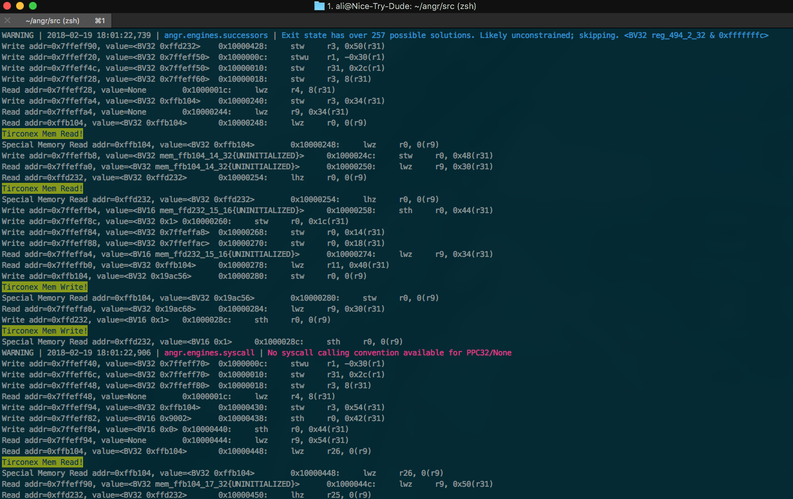

# Triton-Symbolic
## Symbolic Execution of Triton Malware in ANGR
I will eventually link some I/O interfaces to the machine running ANGR and use the Triton to do various manipulation for demonstration of its capabilities. 
.
